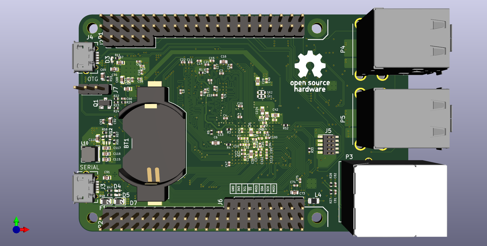
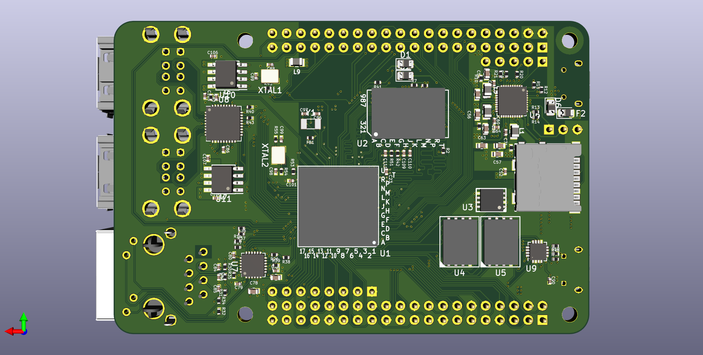
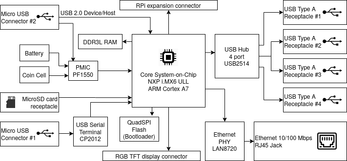

# Project Nanoberry*
(*) Provisional name until we find anything better

# What is it?
Nanoberry is a **single-board computer** capable of running **Linux**. It is built around the **i. MX 6 UltraLite** system-on-chip from NXP. It's **open-source hardware**, its design files are made in **KiCad** and it's free for everyone to produce it, sell it, modify it, and sell modified versions of it.

It is designed to be similar to the very popular **Raspberry PI**, with the same board size and connectors located in the same side. There are some differences, most notably it does not have HDMI output.

The goal is to have a small computer that everybody can modify according to their needs. All the electronics components can be purchased from electronics distributors and its operation is well documented by the manufacturers. This is the main difference with Raspberry PI.

All components are also available in industrial grade, for projects that require extra reliabilty with an increase in the cost. 

## License

You can modify this project and manufacture it, sell it for money, but you have to let me know.

    Nanoberry (provisional name). Open source single board computer.
    Copyright (C) 2020  vpecanins

    This program is free software: you can redistribute it and/or modify
    it under the terms of the GNU General Public License as published by
    the Free Software Foundation, either version 3 of the License, or
    (at your option) any later version.

    This program is distributed in the hope that it will be useful,
    but WITHOUT ANY WARRANTY; without even the implied warranty of
    MERCHANTABILITY or FITNESS FOR A PARTICULAR PURPOSE.  See the
    GNU General Public License for more details.

    You should have received a copy of the GNU General Public License
    along with this program.  If not, see <https://www.gnu.org/licenses/>.

 [GNU GENERAL PUBLIC LICENSE v3](https://www.gnu.org/licenses/gpl-3.0.en.html)

## Specifications

 - System-on-chip NXP i.MX 6 ULL:
	 - ARM Cortex A7 CPU at 900 MHz
	 - Yocto Linux Operating System
 - 4 layer PCB project made in KiCAD
 - Flash memory for program & data storage:
	 - Micro-SD card slot
	 - Onboard QSPI Flash (2 packages) for Bootloader and small OS
 - RAM memory: DDR3L one package
 - Display: 24-bit parallel RGB through bottom connector. (eLCDIF peripheral from i.MX6ULL)
	 - HDMI output would be nice but was discarded due to licensing costs and requirement of NDA does not follow the philosophy of this project.
 - Crypto memory A71CH from NXP to store private/public keys, just for fun because it's cheap.
 - PMIC PF1550 from NXP to generate needed voltages for CPU & memory
 - Ethernet 10/100 one port
 - USB to Serial port bridge for debugging and access Linux console
 - USB OTG port to implement special functions by i.MX (for example Mass Storage Device)
 - 4 port USB HUB to connect keyboard, mouse & other USB devices
 - Battery holder for RTC
 - Many I2C, SPI, I2S, UART, GPIO available through pin headers

## Block Diagram

## Status of the project

Hardware design is 99% done and has not been tested. We have based the design around a reference design from NXP. The most critical part of the layout, that is DDR3 routing, has been copied straight away from reference design.

Up to now this project has been brought up by a single person. This project cannot succeed without a team of people working on it. We need to check the schematics, refine layout, bring up the first prototype, boot Linux on it. If you are interested let me know.

We are also looking for funding/sponsors. NXP, we are using a lot of your chips here, if you are interested please show up now.

## BOM (critical components)

 1. MCIMX6Y2CVM08AB - System on chip Cortex A9 (NXP)
 2. MC34PF1550A6EP - PMIC (NXP)
 3. W634GU6MB - 512 MByte RAM (Winbond)
 4. CP2102N-A01-GQFN20 (SiLabs)
 5. LAN8720A-CP (Microchip)
 6. USB2514B (Microchip)

